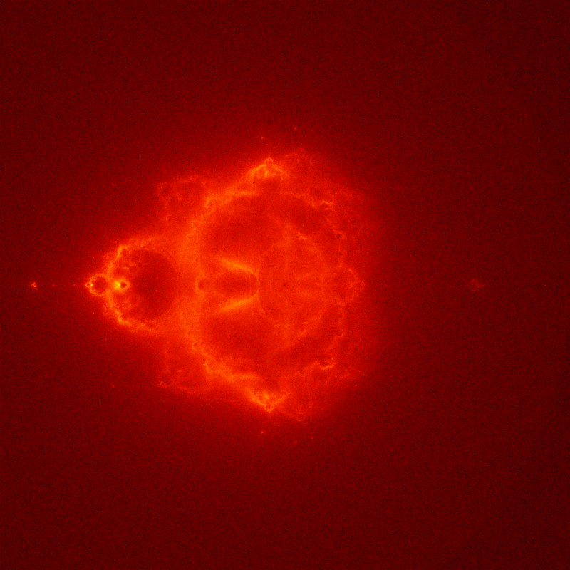

# Buddhabrot Fractal Generator

A high-performance Python implementation of the Buddhabrot fractal rendering algorithm using Numba JIT compilation.



## Overview

The Buddhabrot is a variation of the Mandelbrot set, created by plotting the trajectories of points that escape the set. This implementation provides an efficient method to generate high-resolution Buddhabrot images.

## Mathematical Background

The Buddhabrot is derived from the Mandelbrot set but focuses on the trajectory of escaping points. The core iteration is:

$z_{n+1} = z_n^2 + c$

where:
- $z_0 = 0$
- $c$ is a complex parameter
- Points escape when $|z_n| > 2$

The density function $P(x,y)$ for the Buddhabrot is:

$P(x,y) = \frac{1}{N}\sum_{c \notin M} \sum_{k=1}^{K_c} \delta(x - \text{Re}(z_k))\delta(y - \text{Im}(z_k))$

where:
- $M$ is the Mandelbrot set
- $K_c$ is the escape time for point $c$
- $\delta$ is the Dirac delta function
- $N$ is a normalization factor

## Implementation Details

The algorithm samples points in the complex plane:
- Sampling region: $[-2,2] \times [-2,2]$
- Escape criterion: $|z| > 2$
- Iteration limit: $1000$


## Features

- Fast computation using Numba JIT compilation
- High-resolution output (4000x4000 pixels)
- Logarithmic scaling for better visualization
- Memory-efficient implementation
- Customizable parameters

## Requirements

- Python 3.x
- NumPy
- Matplotlib
- Numba

## Installation

1. Clone this repository:

```bash
git@github.com:tubone24/calculate_buddhabrot.git
cd buddhabrot-generator
```

2. Install required packages:

```bash
poetry install
```

## Usage

Run the script:

```bash
poetry run python calculate_buddhabrot.py
```


The script will:
1. Calculate the Buddhabrot fractal
2. Display progress information
3. Save the result as 'buddhabrot.png'

## Parameters

You can modify these parameters in the script:
- `IMAGE_SIZE`: Resolution of the output image (default: 4000)
- `MAX_ITER`: Maximum number of iterations per point (default: 1000)
- `SAMPLES`: Number of random samples (default: 10^7)
- `X_MIN, X_MAX, Y_MIN, Y_MAX`: Plot boundaries (default: -2.0 to 2.0)

## Output

The program generates a high-resolution image file named 'buddhabrot.png' in the current directory. The image uses a 'hot' colormap and logarithmic scaling for better visualization of the fractal structure.

## Performance

Calculation time varies depending on your hardware specifications and the chosen parameters. On a modern CPU, expect computation times of:
- ~30 minutes with default settings
- Longer for higher SAMPLES or MAX_ITER values

## Contributing

Contributions are welcome! Please feel free to submit a Pull Request.

## License

This project is licensed under the MIT License - see the LICENSE file for details.

## Acknowledgments

This implementation is inspired by various Buddhabrot rendering techniques and optimized for Python using modern numerical computing libraries.

## References

- [Buddhabrot on Wikipedia](https://en.wikipedia.org/wiki/Buddhabrot)
- [The Original Buddhabrot by Melinda Green](https://superliminal.com/fractals/bbrot/)
