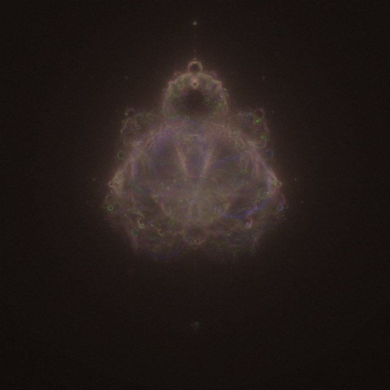

# Buddhabrot Fractal Generator

A high-performance Python implementation of the Buddhabrot fractal rendering algorithm using Numba JIT compilation.



## Overview

The Buddhabrot is a variation of the Mandelbrot set, created by plotting the trajectories of points that escape the set. This implementation provides an efficient method to generate high-resolution Buddhabrot images.

## Mathematical Background(Buddhabrot)

The Buddhabrot is derived from the Mandelbrot set but focuses on the trajectory of escaping points. The core iteration is:

$z_{n+1} = z_n^2 + c$

where:
- $z_0 = 0$
- $c$ is a complex parameter
- Points escape when $|z_n| > 2$

The density function $P(x,y)$ for the Buddhabrot is:

$P(x,y) = \frac{1}{N}\sum_{c \notin M} \sum_{k=1}^{K_c} \delta(x - \text{Re}(z_k))\delta(y - \text{Im}(z_k))$

where:
- $M$ is the Mandelbrot set
- $K_c$ is the escape time for point $c$
- $\delta$ is the Dirac delta function
- $N$ is a normalization factor

## Mathematical Background(Nebulabrot)

The Nebulabrot is an RGB-colored extension of the Buddhabrot, which itself is derived from the Mandelbrot set. The basic iteration remains the same, but the Nebulabrot uses different color channels to represent different escape trajectories.

### RGB Channel Density Functions

The Nebulabrot uses three separate density functions $P_R$, $P_G$, and $P_B$ for each color channel:

$P_k(x,y) = \frac{1}{N_k}\sum_{c \notin M} \sum_{i=1}^{K_c} \delta(x - \text{Re}(z_i))\delta(y - \text{Im}(z_i))$

where:
- $k \in \{R,G,B\}$ represents each color channel
- $M$ is the Mandelbrot set
- $K_c$ is the escape time for point $c$
- $N_k$ is the normalization factor for each channel
- $\delta$ is the Dirac delta function

### Channel-Specific Parameters

Each color channel uses different maximum iteration counts:
- Red: $K_R = 100000$ (short trajectories)
- Green: $K_G = 10000000$ (medium trajectories)
- Blue: $K_B = 10000000$ (long trajectories)

The final image intensity $I(x,y)$ at each point is composed as:

$I(x,y) = \begin{pmatrix}
P_R(x,y) \\
P_G(x,y) \\
P_B(x,y)
\end{pmatrix}$

### Logarithmic Scaling

For better visualization, each channel is logarithmically scaled:

$P'_k(x,y) = \frac{\ln(1 + P_k(x,y)) - \min(\ln(1 + P_k))}{\max(\ln(1 + P_k)) - \min(\ln(1 + P_k))}$

## Implementation Details

The algorithm samples points in the complex plane:
- Sampling region: $[-2,2] \times [-2,2] \subset \mathbb{C}$
- Escape criterion: $|z| > 2$
- Number of samples: $10^7$
- Image resolution: $4000 \times 4000$ pixels

## Visual Interpretation

The different iteration limits for each channel create a depth effect:
- Red channel captures rapid escape trajectories
- Green channel captures intermediate escape trajectories
- Blue channel captures slow escape trajectories

This creates a nebula-like appearance, hence the name "Nebulabrot."

## Requirements

- Python 3.11
- NumPy
- Matplotlib
- Numba

## Installation

1. Clone this repository:

```bash
git@github.com:tubone24/calculate_buddhabrot.git
cd buddhabrot-generator
```

2. Install required packages:

```bash
poetry install
```

## Usage

Run the script:

```bash
poetry run python calculate_buddhabrot.py
```


The script will:
1. Calculate the Buddhabrot fractal
2. Display progress information
3. Save the result as 'nebulabrot.png'

## Parameters

You can modify these parameters in the script:
- `IMAGE_SIZE`: Resolution of the output image (default: 4000)
- `MAX_ITER_R`, `MAX_ITER_G`, `MAX_ITER_B`: Maximum iterations for each color channel (default: 1000, 10000, 100000)
- `SAMPLES`: Number of random samples (default: 10^7)
- `X_MIN, X_MAX, Y_MIN, Y_MAX`: Plot boundaries (default: -2.0 to 2.0)

## Output

The program generates a high-resolution image file named 'nebulabrot.png' in the current directory. The image uses a 'hot' colormap and logarithmic scaling for better visualization of the fractal structure.

## Performance

Calculation time varies depending on your hardware specifications and the chosen parameters. On a modern CPU, expect computation times of:
- ~1500 seconds with default settings
- Longer for higher SAMPLES or MAX_ITER values

## Contributing

Contributions are welcome! Please feel free to submit a Pull Request.

## License

This project is licensed under the MIT License - see the LICENSE file for details.

## Acknowledgments

This implementation is inspired by various Buddhabrot rendering techniques and optimized for Python using modern numerical computing libraries.

## References

- [Buddhabrot on Wikipedia](https://en.wikipedia.org/wiki/Buddhabrot)
- [The Original Buddhabrot by Melinda Green](https://superliminal.com/fractals/bbrot/)
